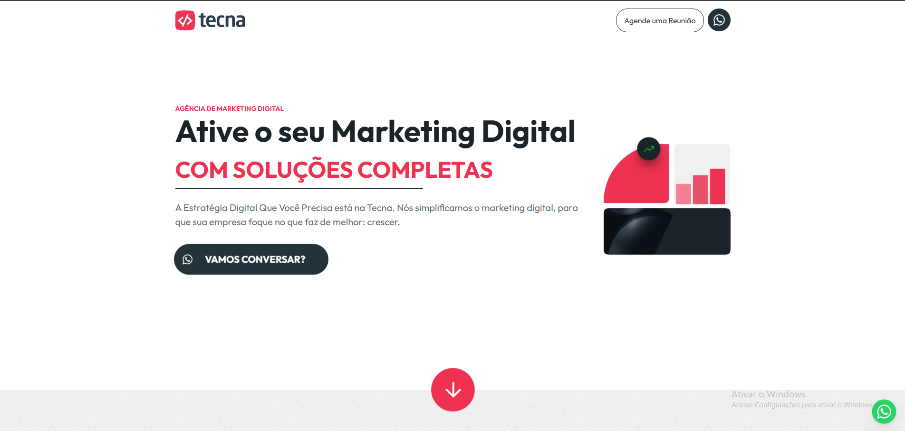

# 🚀 Tecna

### Landing page institucional desenvolvida com foco em conversão, performance e escalabilidade

🔗 **Demonstração ao vivo:**
https://thiago-tsg.github.io/Tecna/

---

## 📸 Prévia



---

## ✨ Sobre o projeto

O **Tecna** é uma landing page institucional desenvolvida durante minha atuação na **Tecna**, com foco na construção de uma experiência moderna, responsiva e otimizada para geração de leads.

Além da implementação visual, o projeto foi estruturado com um pipeline completo de automação front-end, permitindo um fluxo de desenvolvimento mais eficiente e uma versão final otimizada para produção.

---

## 🎯 Objetivo

Desenvolver uma landing page capaz de:

* apresentar a proposta de valor da empresa com clareza
* fortalecer a presença digital da marca
* otimizar a experiência do usuário em diferentes dispositivos
* facilitar a captação de contatos e oportunidades comerciais
* garantir performance e manutenção simplificada

---

## 💡 Abordagem

O projeto foi construído seguindo uma abordagem focada em:

* comunicação objetiva
* hierarquia visual clara
* carregamento otimizado
* arquitetura escalável de front-end
* automação de processos de build

Além do desenvolvimento da interface, foi implementado um workflow capaz de automatizar tarefas repetitivas, reduzindo esforço operacional e aumentando a consistência das entregas.

---

## ⚙️ Funcionalidades

* 📱 Layout totalmente responsivo
* 🎨 Estrutura visual moderna e institucional
* ⚡ Navegação otimizada
* 🖼️ Imagens convertidas automaticamente para WebP
* 🔄 Live Reload durante desenvolvimento
* 🧩 Componentização de trechos HTML
* 📂 Organização de assets para produção
* 🚀 Build automatizado para deploy

---

## 🧠 Destaques técnicos

### ⚡ Performance

* Minificação automática de CSS e JavaScript
* Conversão automática de imagens para WebP
* Redução significativa do peso dos assets
* Build otimizado para ambiente de produção

### 🛠️ Automação

* Pipeline completo utilizando Gulp
* Watch automático de arquivos
* BrowserSync para desenvolvimento local
* Processamento automatizado de imagens

### 🧱 Arquitetura

* Separação entre ambiente de desenvolvimento e produção
* Estrutura modular de SCSS
* Organização de assets e fontes
* Build centralizado e reproduzível

---

## 🔄 Workflow de desenvolvimento

1. Desenvolvimento dos componentes e estilos
2. Processamento automático via Gulp
3. Otimização de imagens e assets
4. Geração da versão final em produção
5. Deploy da aplicação

---

## 🛠️ Stack Tecnológica

* HTML5
* SCSS
* JavaScript (ES6+)
* Gulp.js
* Browserify
* Babel
* BrowserSync
* Imagemin
* WebP
* Node.js

---

## 🚀 Como executar

```bash
git clone https://github.com/thiago-tsg/Tecna.git
cd Tecna
npm install
```

### Ambiente de desenvolvimento

```bash
gulp
```

### Build de produção

```bash
gulp build
```

---

## 📦 Pipeline de automação

O projeto utiliza Gulp para automatizar diversas etapas do fluxo de desenvolvimento:

* Compilação de SCSS
* Bundling de JavaScript
* Transpilação com Babel
* Minificação de arquivos
* Conversão de imagens para WebP
* Organização de assets
* Live Reload
* Geração do build final

---

## 👨‍💻 Contexto profissional

Este projeto foi desenvolvido durante minha atuação na **Tecna**, aplicando conceitos de:

* desenvolvimento front-end
* otimização de performance
* automação de workflows
* organização de projetos escaláveis
* preparação de aplicações para produção

---

## 👨‍💻 Autor

**Thiago Gonçalves**

* GitHub: https://github.com/thiago-tsg
* Portfólio: https://thiago-tsg.github.io/Portifolio/
* Projeto: https://thiago-tsg.github.io/Tecna/
